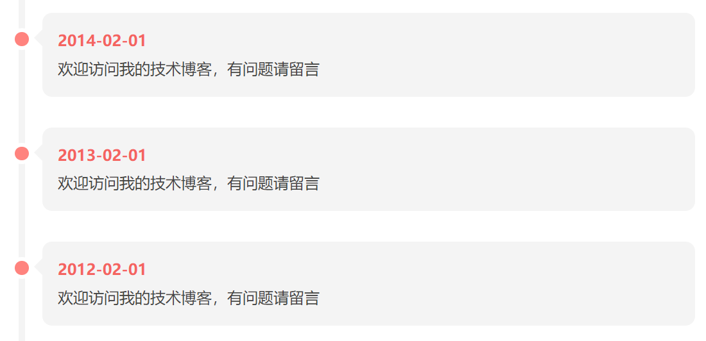
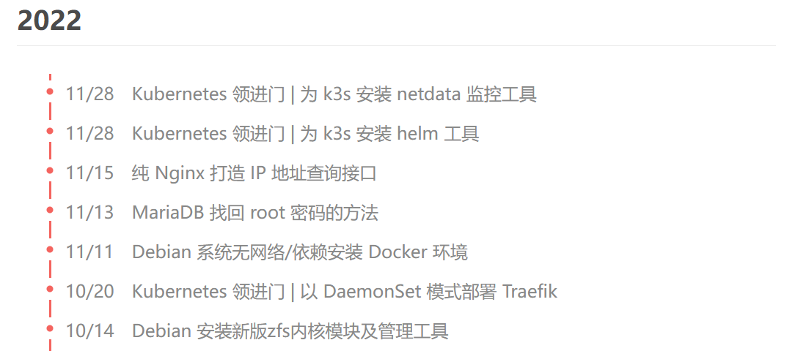
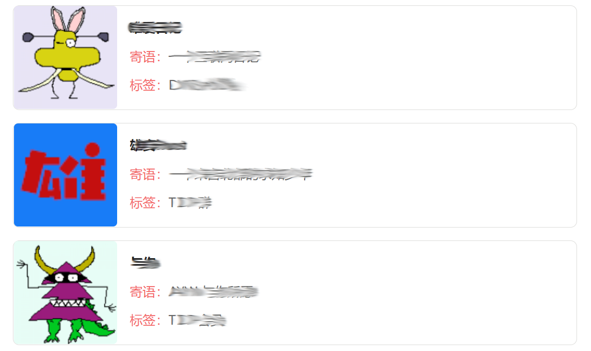

# Waxyz 简约自适应博客主题

## 安装主题

**主题下载地址：[GitHub](https://github.com/rehiy/typecho-theme-waxyz/archive/refs/heads/master.zip)**

把主题解压后上传到`Typecho`安装路径下的`usr/themes/waxyz`目录

登录`Typecho`的管理后台，进入`控制台`->`外观`，点击**waxyz**主题下方的`启用`按钮即可启用

如需修改主题设置，请点击`设置外观`进入主题设置

## 特性说明

- 轻量高效，悦于书写

- 响应式布局

- 图片懒加载/灯箱

- 自定义侧边栏/JS/CSS样式

- 文章置顶/标星/首图/内容失效提醒/阅读剩余部分

- 短代码快捷功能（多彩提示框/多彩文字提示/简易提示框/收缩框/快捷插入音频&视频）

- 置顶公告/CDN切换/代码高亮/时间线/归档页面/技术统计

### 近期更新摘要（倒序）

- 支持文章内图片放大查看

- 支持主题数据备份

- 优化公共资源CDN设置

- 支持导航栏粘滞效果

- 支持头尾自定义代码

- 支持随机背景视频

- 鼠标特效增加对应音效

- 文章底部增加编辑按钮

- 升级 JQuery 为 v3.6.1

- 升级 Bootstrap 为 v3.4.1

- 重写友情链接单页

- 使用系统分页管理器

- 修复一些样式问题

- 优化代码可读性

- 适配高分屏

## 功能介绍

### 短代码用法

短代码可以快速为你提供更多展示效果，使文章层次更丰富。

```bash
#多彩提示框
[info]一般提示[/info]
[warning]警告提示[/warning]
[danger]危险提示[/danger]
[info]多行内容测试：<br />
生活如酒，或芳香，或浓烈，因为诚实，它变得醇厚；生活如歌，或高昂，或低沉，因为守信，它变得悦耳； 生活如画，或明丽，或素雅，因为诚信，它变得美丽。[/info]

#文字提示
[em]警告文字样式[/em]
[hi]高亮文字样式[/hi]
[lo]备注文字样式[/lo]

#插入视频（支持视频静音，自动播放，循环播放）
[video src="视频地址" poster="视频封面地址（可省略）" muted="muted" autoplay="autoplay" loop="loop" ]

#插入音频（支持自动播放，循环播放）
[audio src="音频地址" autoplay="autoplay" loop="loop" ]

#简易提示框（添加close="close"，可以激活关闭按钮）
[alert style="success" close="close"]简易提示框：success，默认样式[/alert]
[alert style="info" close="close"]简易提示框：info[/alert]
[alert style="warning" close="close"]简易提示框：warning[/alert]
[alert style="danger" close="close"]简易提示框：danger[/alert]

#收缩框（添加checked="checked"，自动展开收缩框；style，控制外观样式）
[shrinks title="收缩框：默认样式，自动展开" checked="checked"]内容[/shrinks]
[shrinks title="收缩框：primary" style="primary"]内容[/shrinks]
[shrinks title="收缩框：success" style="success"]内容[/shrinks]
[shrinks title="收缩框：info" style="info"]内容[/shrinks]
[shrinks title="收缩框：warning" style="warning"]内容[/shrinks]
[shrinks title="收缩框：danger" style="danger"]内容[/shrinks]
```

### 独立页面 - 时间线

新建独立页面，选择模板为`时间线`，并在编辑器内按如下格式填写即可。

```bash
- **<红色的标题内容>** <气泡的内容，支持图片，超链接，短代码>
- **<红色的标题内容>** <气泡的内容，支持图片，超链接，短代码>
- **<红色的标题内容>** <气泡的内容，支持图片，超链接，短代码>
- **<红色的标题内容>** <气泡的内容，支持图片，超链接，短代码>
```



### 独立页面 - 文章归档

新建独立页面，选择模板为`文章归档`，编辑器内容留白。发布后，自动产生时间线样式的文章归档。



### 独立页面 - 友情链接

新建独立页面，选择模板为`友情链接`，并在编辑器内按如下格式填写即可。不填写头像则自动使用随机图片替代。

```text
|  站名 | 链接  |  头像 |  寄语 | 标签  |
| ------------ | ------------ | ------------ | ------------ | ------------ |
| 小可      | <https://kerring.me>       |  <http://www.kerring.net/img/kerring.png>   | 资深前后端程序媛                | PHP、JS   |
| 若海      | <https://www.rehiy.com>    |  <http://www.rehiy.com/logo.png>            | 一个全栈攻城狮的纯技术干货分享    | TDP  |
```



## 特别鸣谢

本主题基于 [Waxy](https://github.com/dingzd1995/typecho-theme-waxy) 优化升级（几乎重写），感谢原作者的辛苦付出。
